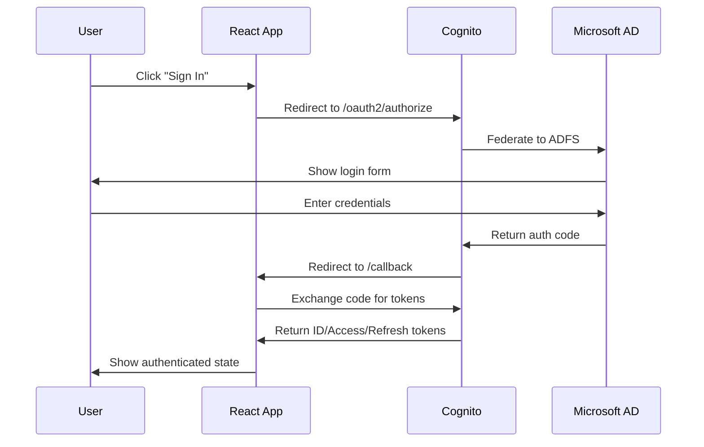
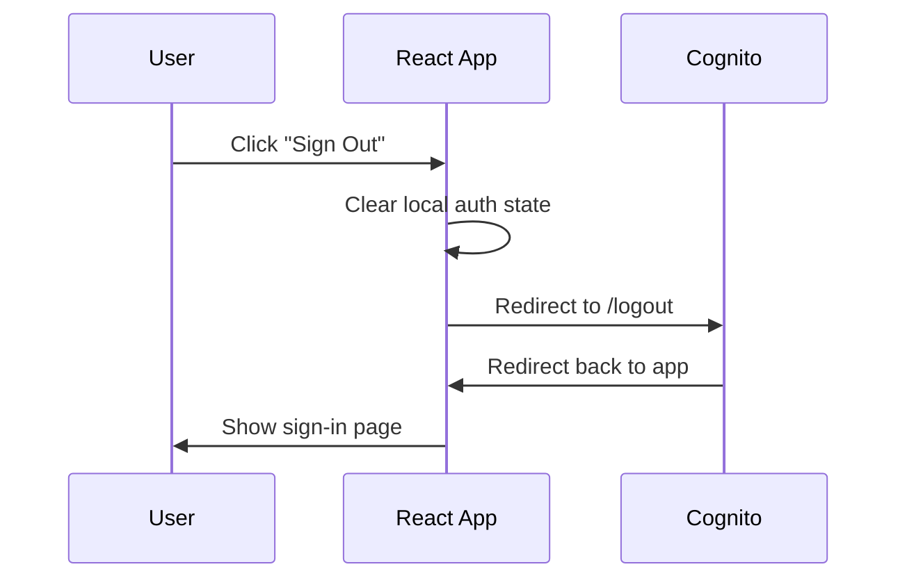

# Cognito Microsoft AD Demo - Technical Documentation

## Architecture Overview

This application demonstrates AWS Cognito integration with Microsoft Active Directory using OIDC (OpenID Connect) authentication flow.

### Key Components

```
┌─────────────────┐    ┌──────────────────┐    ┌─────────────────┐
│   React App     │    │   AWS Cognito    │    │  Microsoft AD   │
│                 │    │   User Pool      │    │     (ADFS)      │
│  - Home Page    │◄──►│                  │◄──►│                 │
│  - Callback     │    │  - Custom Domain │    │  - Federation   │
│  - Auth Context │    │  - OIDC Provider │    │  - User Store   │
└─────────────────┘    └──────────────────┘    └─────────────────┘
```

## Authentication Flow

### 1. Initial Sign-In


### 2. Sign-Out Process


## Code Structure & Explanations

### Root Configuration (`app/root.tsx`)

```typescript
// OIDC Configuration
const cognitoAuthConfig = {
  // Cognito User Pool endpoint for OIDC discovery
  authority: "https://cognito-idp.ap-southeast-1.amazonaws.com/ap-southeast-1_gYsQnwNf1",
  
  // App client ID from Cognito User Pool
  client_id: "5tai0tc43qpu5fq4l8hukmh9q3",
  
  // Where Cognito redirects after authentication
  redirect_uri: "https://demo.nttdata-cs.com/callback",
  
  // OAuth2 flow type
  response_type: "code",
  
  // Requested scopes
  scope: "aws.cognito.signin.user.admin email openid",
  
  // Custom endpoints for your domain
  metadata: {
    issuer: "https://cognito-idp.ap-southeast-1.amazonaws.com/ap-southeast-1_gYsQnwNf1",
    authorization_endpoint: "https://auth.nttdata-cs.com/oauth2/authorize",
    token_endpoint: "https://auth.nttdata-cs.com/oauth2/token",
    end_session_endpoint: "https://auth.nttdata-cs.com/logout"
  }
};
```

**Key Points:**
- `authority`: Points to Cognito for OIDC discovery document
- `metadata`: Overrides endpoints to use custom domain
- `redirect_uri`: Must match Cognito app client configuration

### Authentication Hook Usage (`app/routes/home.tsx`)

```typescript
export default function Home() {
  const auth = useAuth(); // React OIDC Context hook
  const [showTokens, setShowTokens] = useState(false);

  // Handle stale authentication state
  useEffect(() => {
    if (auth.error && auth.error.message.includes("No matching state found")) {
      // Clean URL parameters and clear stale state
      window.history.replaceState({}, document.title, window.location.pathname);
      auth.clearStaleState();
    }
  }, [auth.error]);
```

**Authentication States:**
- `auth.isLoading`: Initial load or processing authentication
- `auth.error`: Authentication errors (network, config, etc.)
- `auth.isAuthenticated`: User successfully authenticated
- `auth.user`: Contains profile and tokens

### Sign-Out Implementation

```typescript
const signOutRedirect = () => {
  // Clear local authentication state first
  auth.removeUser();
  
  // Redirect to Cognito logout endpoint
  const cognitoDomain = "https://auth.nttdata-cs.com";
  const clientId = "5tai0tc43qpu5fq4l8hukmh9q3";
  const logoutUri = "https://demo.nttdata-cs.com";
  
  window.location.href = `${cognitoDomain}/logout?client_id=${clientId}&logout_uri=${encodeURIComponent(logoutUri)}`;
};
```

**Process:**
1. `auth.removeUser()`: Clears tokens from browser storage
2. Redirect to Cognito logout: Terminates Cognito session
3. `logout_uri`: Where user returns after logout

### Callback Handler (`app/routes/callback.tsx`)

```typescript
export default function Callback() {
  const auth = useAuth();
  const navigate = useNavigate();

  useEffect(() => {
    // Redirect to home once authenticated
    if (auth.isAuthenticated) {
      navigate("/");
    }
  }, [auth.isAuthenticated, navigate]);

  // Handle authentication errors
  if (auth.error) {
    return <ErrorUI />;
  }

  // Show loading while processing
  return <LoadingUI />;
}
```

**Purpose:**
- Handles OAuth2 authorization code exchange
- Processes tokens and stores them securely
- Redirects user to main application

## Security Considerations

### Token Management
- **ID Token**: Contains user identity claims
- **Access Token**: Used for API authorization
- **Refresh Token**: Renews expired access tokens

### State Management
- OIDC state parameter prevents CSRF attacks
- Automatic cleanup of stale authentication state
- Secure token storage in browser

### Error Handling
- Network connectivity issues
- Invalid authentication state
- Token expiration scenarios
- Configuration mismatches

## Configuration Requirements

### AWS Cognito User Pool
```json
{
  "allowedCallbackURLs": [
    "https://demo.nttdata-cs.com/callback"
  ],
  "allowedLogoutURLs": [
    "https://demo.nttdata-cs.com"
  ],
  "allowedOAuthFlows": ["code"],
  "allowedOAuthScopes": [
    "openid",
    "email", 
    "aws.cognito.signin.user.admin"
  ]
}
```

### Microsoft AD Federation
- SAML/OIDC identity provider configuration
- Attribute mapping for user claims
- Group membership synchronization

## UI/UX Design Patterns

### Loading States
```typescript
if (auth.isLoading) {
  return (
    <div className="min-h-screen bg-gradient-to-br from-blue-50 to-indigo-100 flex items-center justify-center">
      <div className="text-center">
        <div className="animate-spin rounded-full h-12 w-12 border-b-2 border-indigo-600 mx-auto mb-4"></div>
        <p className="text-gray-600">Loading...</p>
      </div>
    </div>
  );
}
```

### Error States
- Clear error messaging
- Actionable recovery options
- Visual error indicators
- Consistent styling

### Authenticated State
- User profile display
- Collapsible token viewer
- Status indicators
- Secure sign-out

## Troubleshooting Guide

### Common Issues

1. **CORS Errors**
   - Verify authority URL points to correct Cognito endpoint
   - Check custom domain configuration

2. **Redirect Mismatch**
   - Ensure callback URLs match in Cognito app client
   - Verify domain configuration

3. **State Errors**
   - Clear browser storage
   - Check for URL parameter corruption
   - Verify OIDC state handling

4. **Token Issues**
   - Check token expiration
   - Verify scope configuration
   - Ensure proper token storage

### Debug Steps
1. Check browser developer tools for network errors
2. Verify Cognito User Pool configuration
3. Test OIDC endpoints manually
4. Review application logs for authentication flows

## Performance Considerations

- Lazy loading of authentication components
- Efficient token refresh handling
- Minimal re-renders during auth state changes
- Optimized bundle size with tree shaking

## Deployment Notes

### Environment Variables
```bash
REACT_APP_COGNITO_USER_POOL_ID=ap-southeast-1_gYsQnwNf1
REACT_APP_COGNITO_CLIENT_ID=5tai0tc43qpu5fq4l8hukmh9q3
REACT_APP_COGNITO_DOMAIN=https://auth.nttdata-cs.com
```

### Docker Configuration
- Multi-stage build for optimization
- Node.js 20 Alpine base image
- Production dependency separation
- Health check endpoints